

<table>
    <theader>
        <tr>
            <td></td>
            <th>
                UNIVERSIDAD NACIONAL DE SAN AGUSTIN 
                FACULTAD DE INGENIERÍA DE PRODUCCIÓN Y SERVICIOS 
                DEPARTAMENTO ACADÉMICO DE INGENIERÍA DE SISTEMAS E INFORMÁTICA 
                ESCUELA PROFESIONAL DE INGENIERÍA DE SISTEMAS
            </th>
            <td></td>
        </tr>
    </theader>
    <tbody>
        <tr><td colspan="3">Formato: Guía de Práctica de Laboratorio</td></tr>
        <tr><td>Aprobación:  2022/03/01</td><td>Código: GUIA-PRLD-001</td><td>Página: 1</td></tr>
    </tbody>
</table>

GUÍA DE LABORATORIO 

<table>
<theader>
<tr><th colspan="6">INFORMACIÓN BÁSICA</th></tr>
</theader>
<tbody>
<tr><td>ASIGNATURA:</td><td colspan="5">Programación Web 2</td></tr>
<tr><td>TÍTULO DE LA PRÁCTICA:</td><td colspan="5">Python</td></tr>
<tr>
<td>NÚMERO DE PRÁCTICA:</td><td>04</td><td>AÑO LECTIVO:</td><td>2022 A</td><td>NRO. SEMESTRE:</td><td>III</td>
</tr>
<tr>
<td>FECHA INICIO::</td><td>16-May-2022</td><td>FECHA FIN:</td><td>20-May-2022</td><td>DURACIÓN:</td><td>04 horas</td>
</tr>
<tr><td colspan="6">RECURSOS:
    <ul>
        <li>https://www.w3schools.com/python/python_reference.asp</li>
        <li>https://docs.python.org/3/tutorial/</li>
    </ul>
</td>
</<tr>
<tr><td colspan="6">DOCENTES:
<ul>
<li>Richart Smith Escobedo Quispe - rescobedoq@unsa.edu.pe</li>
</ul>
</td>
</<tr>
</tdbody>
</table>

## EJERCICIOS PROPUESTOS

-   La clase [Picture](Tarea-del-Ajedrez/picture.py) contará además con varios métodos que usted deberá implementar:
    1.  verticalMirror: Devuelve el espejo vertical de la imagen
        
        - 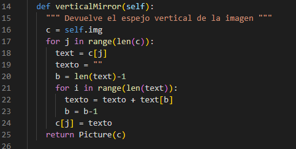
        
        - 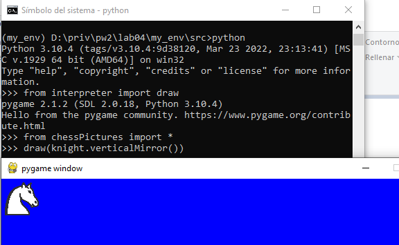
        
    2.  horizontalMirror: Devuelve el espejo horizontal de la imagen
        
        - 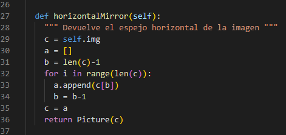
        
        - 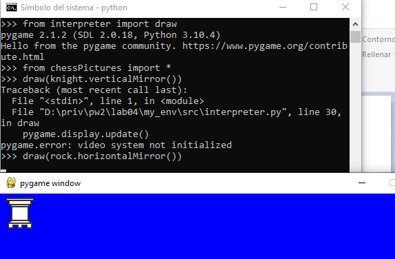
        
    3.  negative: Devuelve un negativo de la imagen
    4.  join: Devuelve una nueva figura poniendo la figura del argumento al lado derecho de la figura actual
        
        - 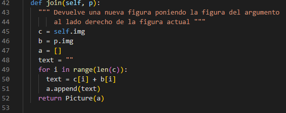
        
        - 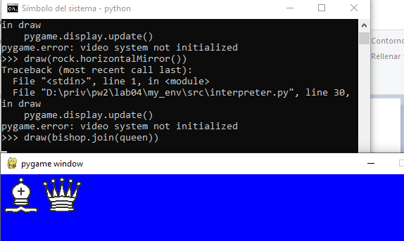
        
    5.  up: Devuelve una nueva figura poniendo la figura recibida como argumento, encima de la figura actual
        
        - 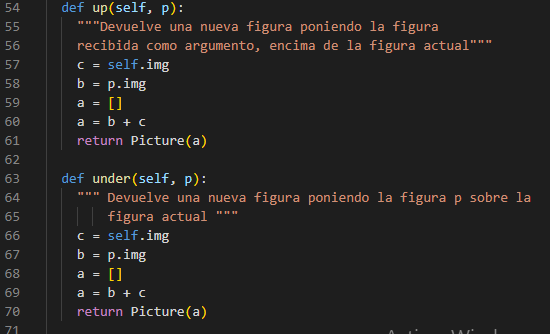
        
        - 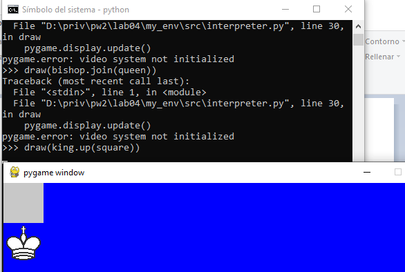
        
    6.  under: Devuelve una nueva figura poniendo la figura recibida como argumento, sobre la figura actual
    7.  horizontalRepeat, Devuelve una nueva figura repitiendo la figura actual al costado la cantidad de veces que indique el valor de n
        
        - 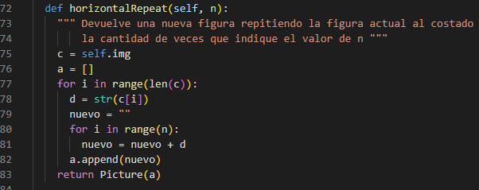
        
        - 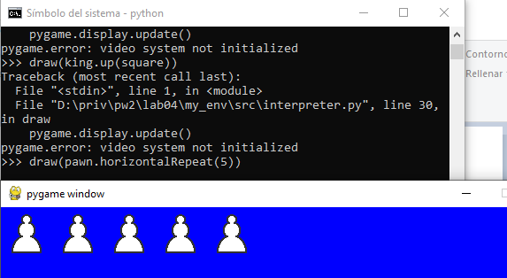
        
    8.  verticalRepeat Devuelve una nueva figura repitiendo la figura actual debajo, la cantidad de veces que indique el valor de n
        
        - 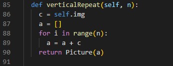
        
        - 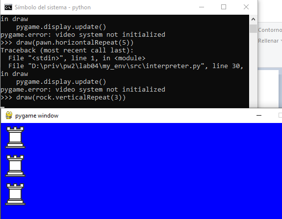

-   Tenga en cuenta que para implementar todos estos métodos, sólo deberá trabajar sobre la representación interna de un Picture, es decir su atributo img.

-   Ejercicios:

    -   Para resolver los siguientes ejercicios sólo está permitido usar ciclos, condicionales, definición de listas por comprensión, sublistas, map, join, (+), lambda, zip, append, pop, range.

        1.  Implemente los métodos de la clase Picture. Se recomienda que implemente la clase picture por etapas, probando realizar los dibujos que se muestran en la siguiente preguntas.
        2.  Usando únicamente los métodos de los objetos de la clase Picture dibuje las siguientes figuras (invoque a draw):

            *    (a) 

            *    (b) 

            *    (c) 

            *    (d) 

            *    (e) 

            *    (f) 

            *    (g) 

#

## CUESTIONARIO
-   ¿Qué son los archivos *.pyc?

     Los archivos PYC son utilizados por el lenguaje de programación Python. PYC es un archivo ejecutable que contiene el código 
     de bytes compilado para un programa escrito en Python. Bytecode es un conjunto de instrucciones para que el intérprete ejecute 
     el programa.
     
-   ¿Para qué sirve el directorio __pycache__?

     Este es un archivo PYC su ventaja es que son las mismas que las de tener un lenguaje compilado en general: son más rápidos y mejoran 
     el tiempo de ejecución. Mientras que el código fuente del módulo no cambia, el intérprete de Python no va a interpretar el 
     módulo cada vez que un programa se ejecuta. Más bien, se usará la versión "lista" del código. Esto disminuye el tiempo utilizado 
     por la interpretación continua de los mismos archivos de origen.
     
-   ¿Cuáles son los usos y lo que representa el subguión en Python?

#

## REFERENCIAS
-   https://www.w3schools.com/python/python_reference.asp
-   https://docs.python.org/3/tutorial/

#

[license]: https://img.shields.io/github/license/rescobedoq/pw2?label=rescobedoq
[license-file]: https://github.com/rescobedoq/pw2/blob/main/LICENSE

[downloads]: https://img.shields.io/github/downloads/rescobedoq/pw2/total?label=Downloads
[releases]: https://github.com/rescobedoq/pw2/releases/

[last-commit]: https://img.shields.io/github/last-commit/rescobedoq/pw2?label=Last%20Commit

[Debian]: https://img.shields.io/badge/Debian-D70A53?style=for-the-badge&logo=debian&logoColor=white
[debian-site]: https://www.debian.org/index.es.html

[Git]: https://img.shields.io/badge/git-%23F05033.svg?style=for-the-badge&logo=git&logoColor=white
[git-site]: https://git-scm.com/

[GitHub]: https://img.shields.io/badge/github-%23121011.svg?style=for-the-badge&logo=github&logoColor=white
[github-site]: https://github.com/

[Vim]: https://img.shields.io/badge/VIM-%2311AB00.svg?style=for-the-badge&logo=vim&logoColor=white
[vim-site]: https://www.vim.org/

[Java]: https://img.shields.io/badge/java-%23ED8B00.svg?style=for-the-badge&logo=java&logoColor=white
[java-site]: https://docs.oracle.com/javase/tutorial/

[![Debian][Debian]][debian-site]
[![Git][Git]][git-site]
[![GitHub][GitHub]][github-site]
[![Vim][Vim]][vim-site]
[![Java][Java]][java-site]

[![License][license]][license-file]
[![Downloads][downloads]][releases]
[![Last Commit][last-commit]][releases]
